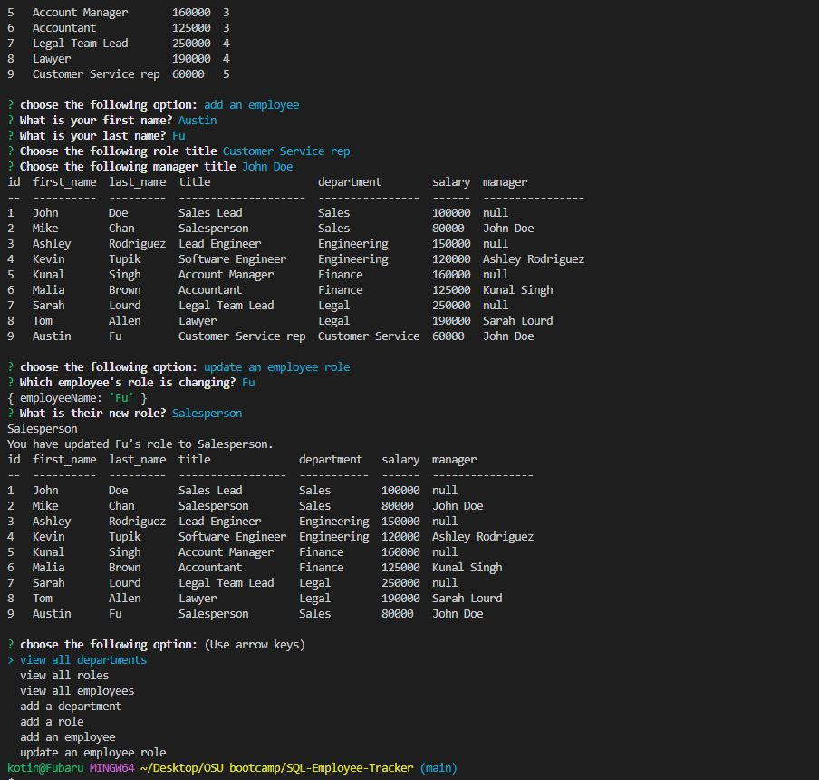

# SQL-Employee-Tracker

## Description

Users can use command line input aplication to be able to make edits to their employee information table. The user can add departments, roles, and employees. In addition, the user can update the employee's role. All edits made can be views by selecting the view choices of view departments, roles, and employees. 

## Table of Contents (Optional)

- [Installation](#installation)
- [Usage](#usage)
- [Credits](#credits)
- [License](#license)
- [Features](#features)
- [Questions](#questions)

## Installation

Node, NPM, dotenv, console.table, inquirer, mysql, and VS Code

## Usage

Demo: https://youtu.be/v41LZRDTMK0

Screenshots:

## Credits

Instructor Phil Loy and ikra-rafi on her help with the update employee function. 

## License

---

## Badges

## Features

* View departments, roles, and employees. 
* Generates a database table for employees. 

## Questions

[GitHub Repository](https://github.com/fubaru)

Reach me via email for additional questions: austinfu0422@gmail.com